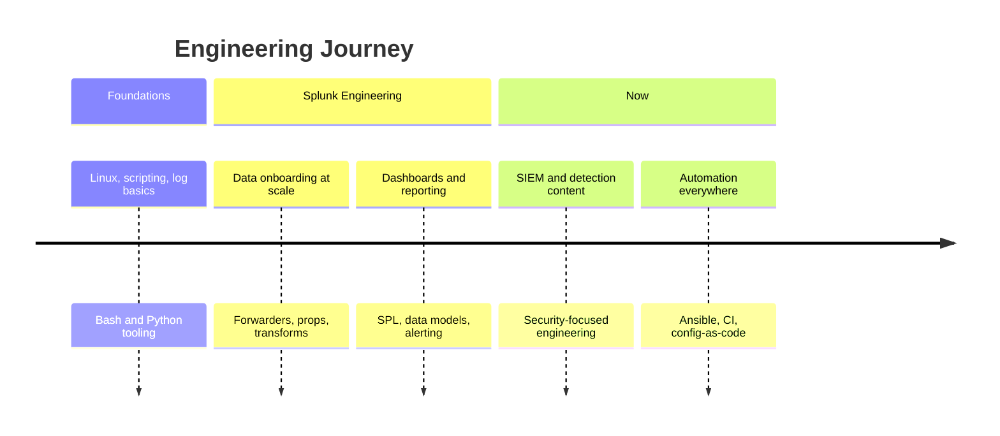

<!-- ═══════════════════════════════ HERO ═══════════════════════════════ -->

<div align="center">


<br/>


<br/><br/>

<a href="mailto:happyramani86@gmail.com"></a>
<a href="https://github.com/cr-hramani"></a>
<!-- TODO: replace YOUR-HANDLE with your real LinkedIn handle -->
<a href="https://www.linkedin.com/in/YOUR-HANDLE"></a>


</div>

<!-- ═══════════════════════════════ ABOUT ═══════════════════════════════ -->

## 🧠 &nbsp;About Me

```yaml
name:      Happy Ramani
role:      Splunk Engineer
company:   CrossRealms International
location:  # TODO: add your city
focus:
  - SIEM engineering & data onboarding
  - Detection content and alerting
  - Dashboards people actually use
  - Automation with Python / Ansible / PowerShell
currently_learning:
  - Detection-as-code workflows
  - Cloud security telemetry (Azure / AWS)
ask_me_about:
  - Splunk SPL, props/transforms, data models
  - Universal Forwarder deployment at scale
  - Turning noisy logs into signal
fun_fact: "A good dashboard answers the question
           before you finish asking it."
```

<div align="center">

</div>

<!-- ═══════════════════════════════ TECH STACK ═══════════════════════════════ -->

## ⚡ &nbsp;Tech Stack

<div align="center">

**Core Platform**


**Languages &amp; Automation**


**Cloud &amp; Infrastructure**


**Data &amp; Interchange**


<br/>


</div>

<!-- ═══════════════════════════════ SKILLS ═══════════════════════════════ -->

## 📊 &nbsp;Skill Levels

<div align="center">

| Domain | Proficiency | |
| :--- | :--- | ---: |
| **Splunk / SPL** | `████████████████████` | 95% |
| **Data Onboarding & Parsing** | `██████████████████░░` | 90% |
| **Dashboards & Visualisation** | `██████████████████░░` | 90% |
| **Python** | `████████████████░░░░` | 80% |
| **Ansible** | `███████████████░░░░░` | 75% |
| **PowerShell / Bash** | `███████████████░░░░░` | 75% |
| **Cloud (Azure / AWS)** | `█████████████░░░░░░░` | 65% |
| **Docker / Kubernetes** | `██████████░░░░░░░░░░` | 50% |

<sub>📝 <b>TODO:</b> tune these percentages to your own honest assessment.</sub>


</div>

<!-- ═══════════════════════════════ ANALYTICS ═══════════════════════════════ -->

## 📈 &nbsp;GitHub Analytics

<div align="center">


<br/><br/>


<br/><br/>


<br/>


<br/>


</div>

<!-- ═══════════════════════════════ SNAKE ═══════════════════════════════ -->

## 🐍 &nbsp;Contribution Snake

<div align="center">

<picture>
  <source media="(prefers-color-scheme: dark)" srcset="https://raw.githubusercontent.com/cr-hramani/cr-hramani/output/github-snake-dark.svg" />
  <source media="(prefers-color-scheme: light)" srcset="https://raw.githubusercontent.com/cr-hramani/cr-hramani/output/github-snake.svg" />
  
</picture>

<sub>Regenerated every 12h by GitHub Actions — <code>.github/workflows/snake.yml</code></sub>


</div>

<!-- ═══════════════════════════════ CURRENT FOCUS ═══════════════════════════════ -->

## 🎯 &nbsp;Current Focus

| | Now | Next |
| :--- | :--- | :--- |
| 🔭 **Building** | SIEM onboarding pipelines &amp; detection content | Detection-as-code with CI validation |
| 🌱 **Learning** | Cloud security telemetry (Azure / AWS) | Kubernetes observability |
| 🤝 **Open to** | Splunk / SIEM collaboration, dashboard reviews | Talks &amp; write-ups |
| ⚙️ **Automating** | UF deployment, app packaging, health checks | Full config-as-code rollout |

<!-- ═══════════════════════════════ PROJECTS ═══════════════════════════════ -->

## 🚀 &nbsp;Featured Projects

<div align="center">

<!-- TODO: replace REPO-NAME with real repositories, or delete this whole section -->
<a href="https://github.com/cr-hramani">
  
</a>
<a href="https://github.com/cr-hramani">
  
</a>

<sub>⚠️ <b>Placeholder</b> — these render as errors until real repo names are filled in.</sub>

</div>

<!-- ═══════════════════════════════ TIMELINE ═══════════════════════════════ -->

## 🗓️ &nbsp;Experience Timeline



<sub>📝 <b>TODO:</b> replace with your real roles and years.</sub>

<!-- ═══════════════════════════════ CERTIFICATIONS ═══════════════════════════════ -->

## 🏅 &nbsp;Certifications

<div align="center">

<!-- TODO: keep ONLY the certifications you actually hold -->


<br/>
<sub>⚠️ <b>Placeholder badges — delete any you do not hold before merging.</b></sub>

</div>

<!-- ═══════════════════════════════ QUOTE ═══════════════════════════════ -->

<div align="center">


</div>

<!-- ═══════════════════════════════ CONNECT ═══════════════════════════════ -->

## 🌐 &nbsp;Connect With Me

<div align="center">

<a href="mailto:happyramani86@gmail.com"></a>
<!-- TODO: real URLs for the three below -->
<a href="https://www.linkedin.com/in/YOUR-HANDLE"></a>
<a href="https://github.com/cr-hramani"></a>
<a href="https://github.com/cr-hramani"></a>

</div>

<!-- ═══════════════════════════════ FOOTER ═══════════════════════════════ -->

<div align="center">


</div>
